# VBR Pulse

A small demo app that makes the Veeam Backup & Replication 13.1 REST API (`1.3-rev2`) visible:
every action in the UI is paired with an **API inspector** that shows the exact request and
response behind it, with a link to the operation in the official reference.

Plan and specification: [docs/VBR_Pulse_Implementation_Plan.md](docs/VBR_Pulse_Implementation_Plan.md).

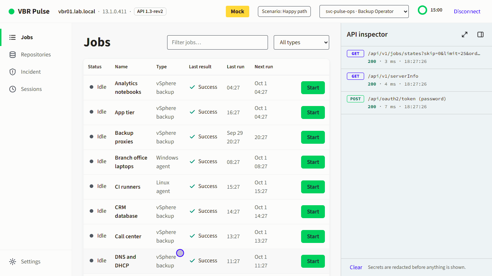

## See it in action

Recorded in mock mode at 1366×768, the plan's projector size. Waits for sessions are sped
up; clicks and typing play in real time.

| | |
|---|---|
| 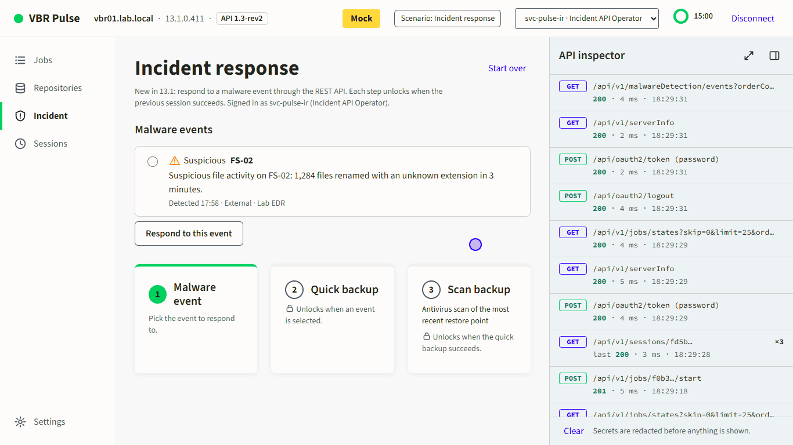 | 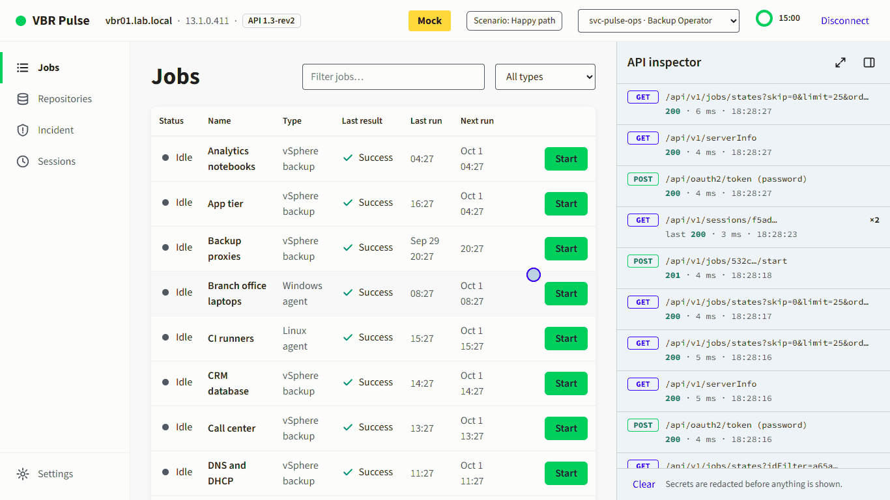 |
| **Incident response (13.1).** Malware event → vSphere Quick Backup → backup scan. | **Failure.** The session stops at 63 %, and Pulse fetches the log lines on its own. |
| 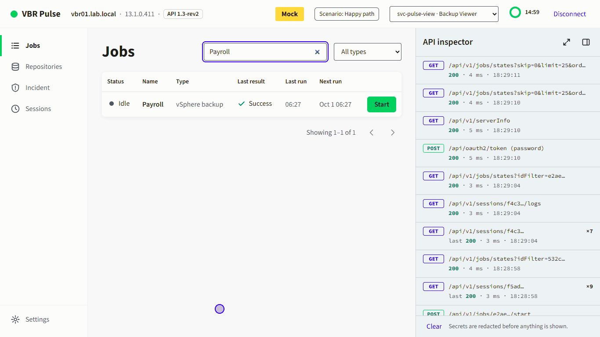 | 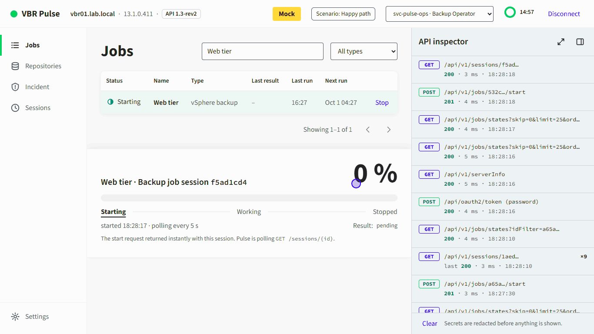 |
| **Role-based access.** A Backup Viewer gets 403; one click switches to the operator. | **API inspector.** Redacted token, body and response, and copy as cURL. |

<details>
<summary>Presenter mode</summary>

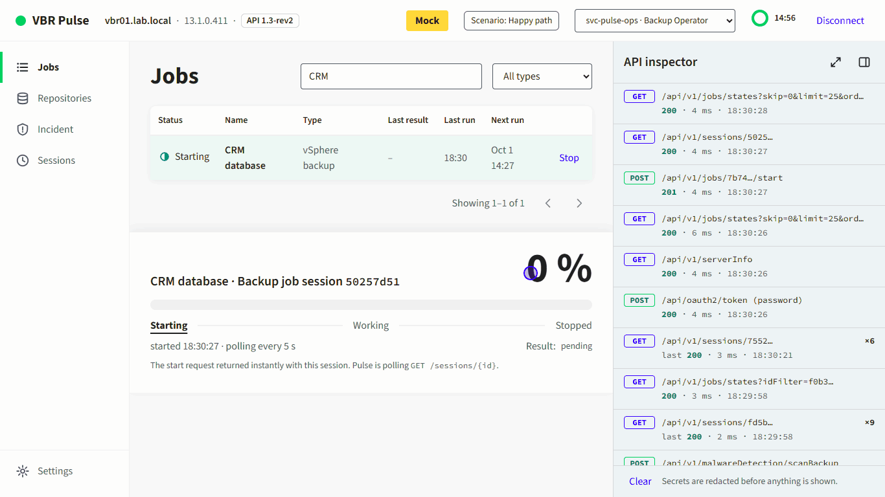

`P` switches to presenter mode for the back row; `I` hides and shows the inspector.
</details>

## Screenshots

All screenshots use mock mode, so they contain no real server data.

| | |
|---|---|
| 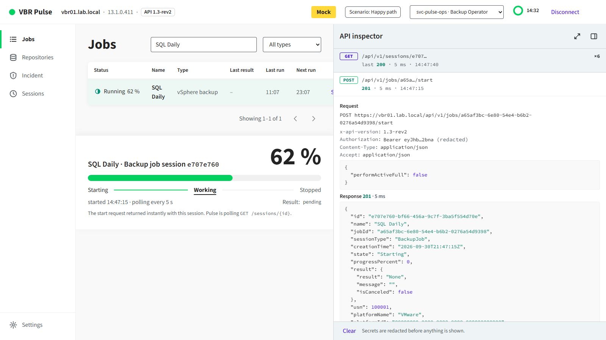 | 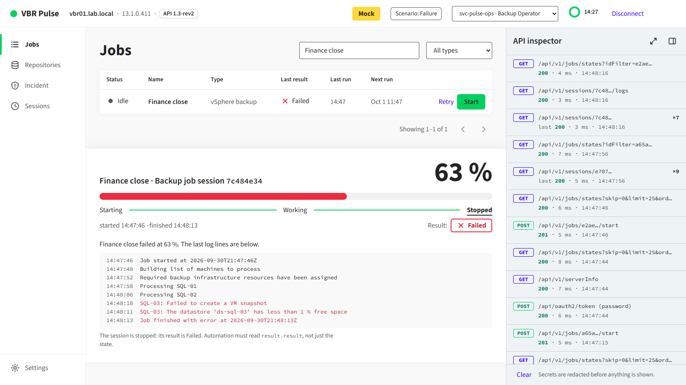 |
| **API inspector.** Every call, with the token redacted, a copy-as-cURL button and a link to the operation in the reference. | **Failure handling.** The session stops at 63 %, and Pulse fetches the log lines automatically. |
| 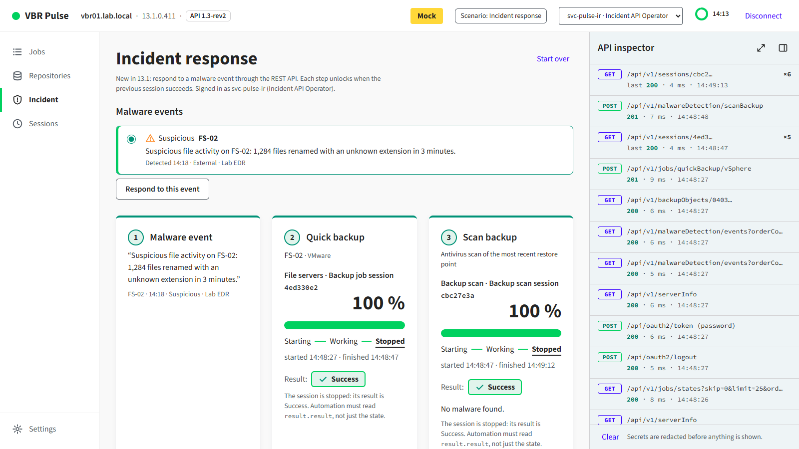 | 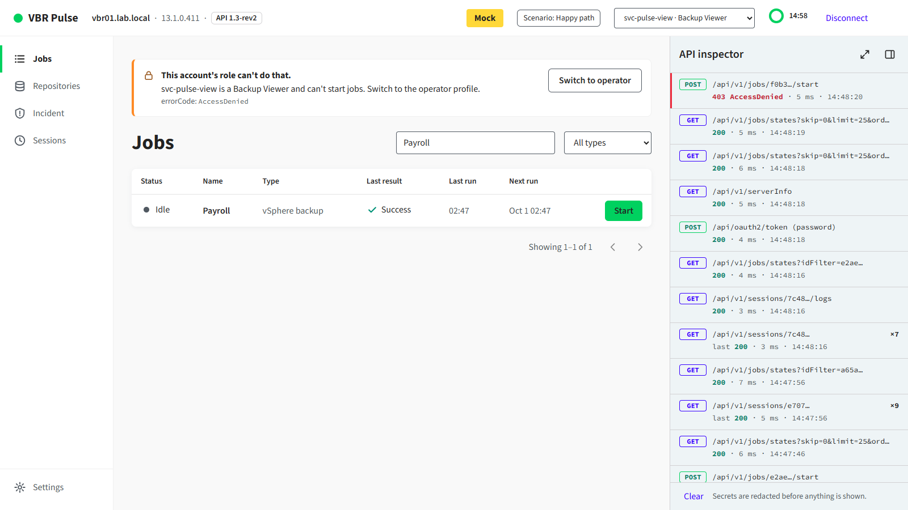 |
| **Incident response (13.1).** Malware event → vSphere Quick Backup → backup scan. Each step unlocks when the previous one succeeds. | **Role-based access.** The same Start request returns 403 for a Backup Viewer, and the callout names the role. |
| 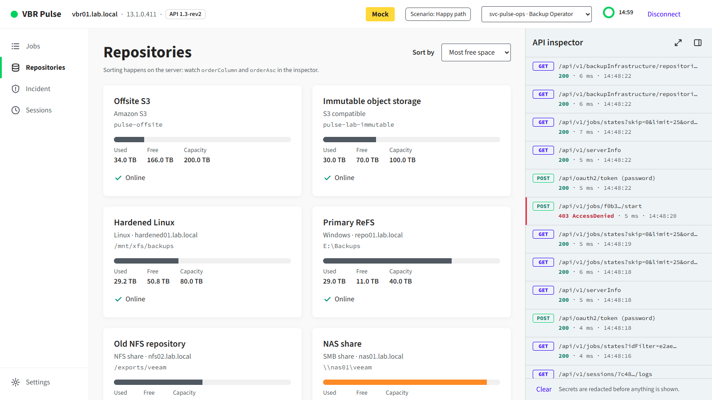 | 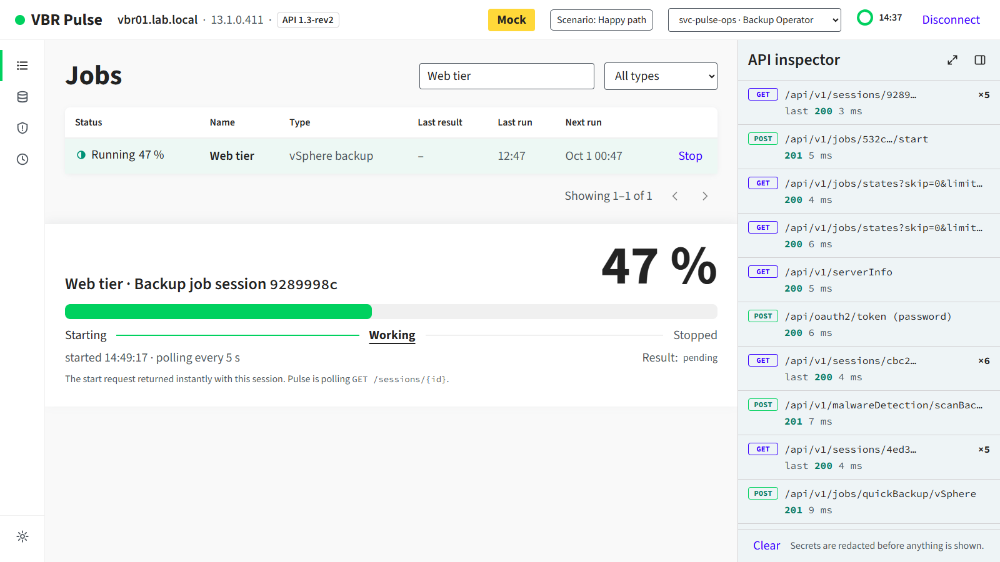 |
| **Repositories.** Sorting happens on the server; the inspector shows `orderColumn` and `orderAsc`. | **Presenter mode (`P`).** Larger type for the back row, an icon-only rail, and a trimmed inspector. |

<details>
<summary>Sign-in</summary>

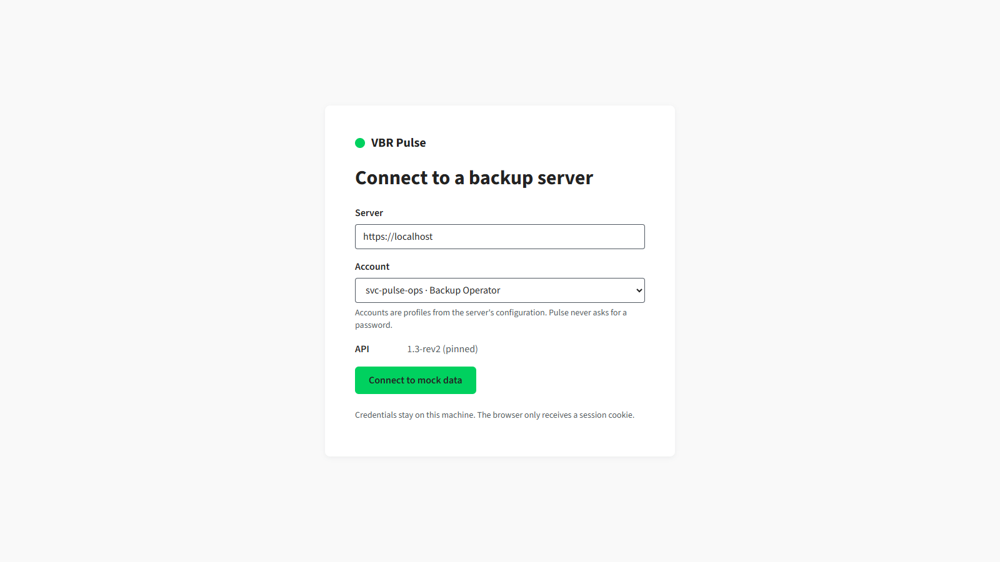

Accounts are profiles from the configuration. Pulse never asks for a password.
</details>

## Download for a presenter laptop (no Python needed)

Standalone builds for **Windows x64** and **macOS on Apple Silicon** are attached to each
[GitHub Release](../../releases) as `vbr-pulse-<version>-windows-x64.zip` and
`vbr-pulse-<version>-macos-arm64.zip`, with a `SHA256SUMS.txt`. Unzip the folder anywhere and:

- **Windows:** double-click `pulse.exe`. The builds aren't code-signed yet, so the first time
  SmartScreen says it "protected your PC": choose **More info → Run anyway**.
- **macOS:** the build isn't signed or notarized, so clear the download quarantine once, then
  double-click `pulse` (it opens in Terminal):

  ```bash
  xattr -dr com.apple.quarantine ~/Downloads/vbr-pulse-0.2.0-macos-arm64
  ```

Pulse opens in your browser on <http://127.0.0.1:8000>, and mock data works immediately. The
console window must stay open; close it to stop Pulse. To connect to a lab server, run these in a
terminal in that folder (`pulse.exe` on Windows, `./pulse` on macOS):

```bash
pulse init                      # creates your settings file and prints where it is
pulse secret set svc-pulse-ops  # stores a password in the OS keychain; repeat per account
pulse preflight                 # checks the server, every account and the demo job
```

Settings live in a per-user folder (`%APPDATA%\vbr-pulse\pulse.env` on Windows,
`~/Library/Application Support/vbr-pulse/pulse.env` on macOS). A `pulse.env` next to the
executable wins, for USB-stick use. `pulse config` shows which file is used and which accounts
have a stored password.

## Quick start from source

Requires Python 3.12 and [uv](https://docs.astral.sh/uv/).

```bash
uv sync
uv run pulse serve --mock
```

Open <http://127.0.0.1:8000>, choose an account and **Connect to mock data**. Press `?` for
keyboard shortcuts, `P` for presenter mode, `S` to pick a mock scenario.

## Status

| Phase | Scope | State |
|---|---|---|
| 0 | Repo layout, spec, generated operations + models | Done |
| 1 | `VbrClient`: auth, refresh, retry, paging, errors, inspector events, redaction | Done |
| 2 | Mock VBR server, six scenarios, spec-validated fixtures | Done |
| 3 | Web layer: sign-in, session cookie, `SessionTracker`, SSE, htmx partials | Done |
| 4 | UI shell, design system, inspector, token ring, presenter mode, shortcuts | Done |
| 5 | Jobs, live session track, sessions screen | Done |
| 6 | Repository cards with server-side sorting | Done |
| 7 | 13.1 incident flow, lab seeding, RBAC demo | Done |
| 8 | Security checks, `uv run pulse`, Dockerfile, CI, standalone releases | Done |
| 9 | Demo rehearsal on the presenter laptop | For the presenter — see below |

## Connecting to a lab server

Prerequisites on the lab side (PLAN §5.4, Appendix D):

- Veeam Backup & Replication **13.1** (build 13.1.0.411 or later), REST API on port **443**.
- Three accounts, each flagged as a **service account** if MFA is enforced (MFA isn't supported
  for non-interactive REST sign-in):

  | Profile | Account | Role |
  |---|---|---|
  | `ops` | `svc-pulse-ops` | Backup Operator (or a custom role scoped to the demo jobs) |
  | `ir` | `svc-pulse-ir` | Incident API Operator |
  | `view` | `svc-pulse-view` | Backup Viewer |

- One idle job whose **description contains `[pulse-demo]`** and finishes in under 60 s. Lab
  tests and the pre-flight check only ever start that job.

On the laptop (from source; with a release build, drop `uv run` and use `pulse init`):

```bash
cp .env.example .env                        # set PULSE_VBR_URL and the profile users
uv run pulse secret set svc-pulse-ops       # repeat for each account; never put secrets in .env
uv run pulse preflight                      # checks 443, every sign-in, the demo job, malware events
uv run pulse                                # serve the UI on http://127.0.0.1:8000
```

Secrets are resolved per profile in this order: OS keyring (`vbr-pulse` / username) → a
literal `PULSE_PROFILE_<NAME>_SECRET` → a `vault://<service>/<name>` reference looked up in the
keyring. Set `PULSE_PROFILE_<NAME>_ROLE` so a 403 can name the role (VBR's 403 doesn't).

TLS verification is always on. Pulse trusts the OS certificate store, or the CA bundle in
`PULSE_CA_BUNDLE`. `PULSE_LAB_INSECURE_TLS=true` turns checks off and shows a red banner on
every screen; use it only in an isolated lab.

## Demo scripts

The five- and ten-minute scripts are in PLAN §12. In mock mode, pick the scenario first (`S`):

| Scenario | What happens |
|---|---|
| `happy` | Start job → Starting → Working 0→100 % over ~40 s → Stopped / Success |
| `warning` | Same, ends Stopped / Warning with a skipped machine |
| `failed` | Fails at 63 %; the last log lines appear automatically |
| `token-expiry` | The server expires the access token after 60 s → 401 → silent refresh |
| `forbidden` | Every account is treated as a Backup Viewer → 403 on start |
| `incident` | Malware event → Quick Backup → backup scan → Success |

For the RBAC moment, switch account from the top bar; the incident flow signs in as `ir`.

### Keyboard shortcuts

`P` presenter mode · `I` toggle inspector · `1`–`4` Jobs / Repositories / Incident / Sessions ·
`/` focus the job filter · `S` scenario picker (mock) · `?` shortcuts · `Esc` close.

### Rehearsal (Phase 9)

This part needs the presenter and the real laptop:

1. `uv run pulse preflight --mock` and, with the lab reachable, `uv run pulse preflight`.
2. Run both scripts from PLAN §12 in mock and live mode; time them.
3. Record a fallback screen capture of the full demo.
4. Walk the manual items of Appendix D (display, zoom, notifications, fallback video).

## Troubleshooting

| You see | Do this |
|---|---|
| "Can't reach vbr01.lab.local on port 443" | Check the address, VPN and firewall; 13.1 serves REST on 443 (never 9419). |
| "The server's certificate isn't trusted" | Put the lab CA in `PULSE_CA_BUNDLE`, or trust it in the OS store. |
| "The server rejected the credentials" | Check the keyring entry; make sure the account isn't locked and is a service account if MFA is on. |
| "This account's role can't do that" | Expected for the viewer; otherwise check the account's role in VBR. |
| "Your session expired. Sign in again." | The refresh token was rejected; sign in again. |
| Live profiles aren't configured | Add `PULSE_PROFILE_<NAME>_USER` lines to `.env`. Mock data still works. |

## Development

```bash
uv run pytest                 # unit, contract, integration and web tests (~25 s)
uv run pytest -m e2e          # Playwright: screenshots, axe-core, keyboard (~2 min)
uv run pytest -m lab          # against the lab server in .env (opt-in)
uv run ruff check src tests scripts && uv run ruff format --check src tests scripts
uv run mypy
uv run pulse scenarios -v     # all six mock scenarios end to end, printing every call
```

On Windows the browser tests drive the installed Edge; elsewhere run
`uv run playwright install chromium` once. Screenshots land in `test-results/screenshots/`.

Regenerate code after replacing the spec:

```bash
uv run python scripts/gen_operations.py
uv run python scripts/gen_models.py
uv run python scripts/make_mock_fixtures.py
```

Refresh the README screenshots and animations after UI changes (mock mode only; about three
and six minutes, because sessions run in real time):

```bash
uv run python scripts/readme_screenshots.py
uv run python scripts/readme_gifs.py            # or one clip: readme_gifs.py incident
```

### Layout

```
src/pulse/vbr/        VbrClient, operations (generated), spec validation, SessionTracker, incident helpers
src/pulse/inspector/  event bus + redaction
src/pulse/mock/       mock VBR server, scenarios, fixtures, scenario runner
src/pulse/web/        FastAPI app, routes, SSE, Jinja2 templates, CSS/JS, self-hosted fonts
tests/                unit, contract, integration, web, e2e (Playwright), lab
```

### About the OpenAPI spec

`openapi/vbr-1.3-rev2.json` was extracted from the public 1.3-rev2 reference with
`scripts/extract_reference_spec.py`. The plan prefers the `swagger.json` exported from your own
13.1 server (it ships in the Veeam Backup & Replication installation folder and is served by its
Swagger UI). Swap it in and regenerate when a lab server is available.

### Standalone builds

```bash
uv sync --group release
uv run python scripts/build_release.py   # build, smoke-test, zip into dist/
```

PyInstaller can't cross-compile, so this builds for the machine it runs on. Publishing a release
for both platforms is done by CI: see [docs/RELEASING.md](docs/RELEASING.md).

### Docker (optional)

```bash
docker build -t vbr-pulse .
docker run --rm -p 127.0.0.1:8000:8000 --env-file .env vbr-pulse
```

There's no OS keyring inside the container, so pass secrets as `PULSE_PROFILE_<NAME>_SECRET`
environment variables, and keep the port published on loopback.

## Known gaps

- Mock fixtures are authored stand-ins; replace them with anonymised lab recordings
  (`pulse record`, planned for v1.1).
- The lab is VMware-only, so Quick Backup supports vSphere VMs (and agent-managed machines);
  Hyper-V was removed. The request is built from `GetBackupObject`; its `hostName` is the
  vCenter, the first segment of the backup object's `path` (confirmed on a 13.1.1.18 lab:
  `vcenter\datacenter\folder\vm`). The Quick Backup call itself hasn't run against the lab yet.
- Mock-only guesses (status codes for "already running", the result of a user-stopped job)
  should be checked against the lab server.
