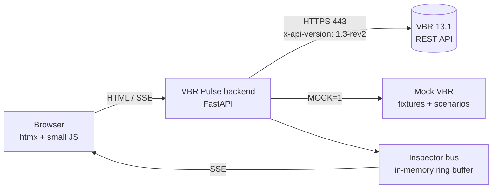

# VBR Pulse — Implementation Plan

A small demo application for the Veeam Backup & Replication REST API, designed to be built with Claude Code.

| Item | Value |
|---|---|
| Target product | Veeam Data Platform — Veeam Backup & Replication 13.1 (build 13.1.0.411 or later) |
| REST API revision | `1.3-rev2` (header `x-api-version`) |
| REST endpoint | `https://<vbr-host>/api` on port 443 (9419 legacy only) |
| Primary audience | Pre-sales engineers, partner SEs and technical trainers running live demos |
| Document status | Draft v1.0 — 30 September 2026 |

---

## 1. Purpose

VBR Pulse makes the REST API *visible*. Every action in the UI (log in, list jobs, start a job, watch its session, trigger a quick backup after a malware event) is paired with an **API Inspector** that shows the exact HTTP request and response behind it, with a link to the matching page in the official reference.

The demo should let a presenter show, in under ten minutes:

1. OAuth 2.0 authentication, including the 15-minute access token and automatic refresh.
2. Reading collections with server-side filtering and pagination.
3. The asynchronous **session pattern**: trigger → poll → stopped → evaluate result.
4. A 13.1 security workflow: malware event → Quick Backup → backup scan.
5. Role-based access control: the same request succeeding as one account and returning 403 as another.

### Success criteria

- A cold start to first screen in under 5 seconds on a presenter laptop.
- The full happy-path demo runs identically against a live lab server **and** in offline mock mode.
- No credential, token or password is ever rendered in the browser or written to logs.
- Every API call in the inspector links to its operation in the 1.3-rev2 reference.

---

## 2. Scope

**In scope (v1)**

- Login, token lifecycle display, logout.
- Server overview (name, build, platform, certificate thumbprint).
- Job board: job states, filter by name/type, start/stop/retry, live session tracking, session log viewer.
- Repository health: repository states with capacity and status.
- Incident flow (13.1): list malware events, start Quick Backup for Hyper-V or agent-managed machines, start a backup scan, track sessions.
- API Inspector drawer with redaction, copy-as-cURL and docs deep links.
- Mock mode with scripted scenarios (success, warning, failure, token expiry, forbidden).
- Presenter mode (larger type, simplified inspector, keyboard shortcuts).

**Out of scope (v1)**

- Creating or editing jobs, repositories, credentials or roles (read and trigger only — safer on stage).
- Restores other than showing restore points. (Instant Recovery is a v2 candidate.)
- Multi-server management, Enterprise Manager API, Veeam ONE or VSPC APIs.
- Production hardening beyond what a lab/demo tool needs (see §9 for what *is* required).

---

## 3. Official documentation

Keep these open while building. The OpenAPI specification downloaded from your own server is the **source of truth**; the web reference explains behaviour.

### Veeam

| Topic | Link |
|---|---|
| REST API reference 1.3-rev2 — overview (URLs, versioning, auth, headers, query parameters, Swagger) | https://helpcenter.veeam.com/references/vbr/13/rest/1.3-rev2/tag/SectionOverview |
| 1.3-rev2 changelog, including breaking changes | https://helpcenter.veeam.com/references/vbr/13/rest/1.3-rev2/tag/SectionChangelog |
| How-To guides (malware detection, Hyper-V, agents, file restore, Azure IR) | https://helpcenter.veeam.com/references/vbr/13/rest/1.3-rev2/tag/SectionHowTo |
| Malware detection workflow (How-To) | https://helpcenter.veeam.com/references/vbr/13/rest/1.3-rev2/tag/SectionHowTo#section/Malware-Detection |
| Login (get token, log out) | https://helpcenter.veeam.com/references/vbr/13/rest/1.3-rev2/tag/Login |
| Service (server time, certificate, server info) | https://helpcenter.veeam.com/references/vbr/13/rest/1.3-rev2/tag/Service |
| Jobs | https://helpcenter.veeam.com/references/vbr/13/rest/1.3-rev2/tag/Jobs |
| Sessions | https://helpcenter.veeam.com/references/vbr/13/rest/1.3-rev2/tag/Sessions |
| Repositories | https://helpcenter.veeam.com/references/vbr/13/rest/1.3-rev2/tag/Repositories |
| Backups | https://helpcenter.veeam.com/references/vbr/13/rest/1.3-rev2/tag/Backups |
| Restore points | https://helpcenter.veeam.com/references/vbr/13/rest/1.3-rev2/tag/Restore-Points |
| Malware detection | https://helpcenter.veeam.com/references/vbr/13/rest/1.3-rev2/tag/Malware-Detection |
| Security (Security & Compliance Analyzer, authorization events) | https://helpcenter.veeam.com/references/vbr/13/rest/1.3-rev2/tag/Security |
| Users and roles | https://helpcenter.veeam.com/references/vbr/13/rest/1.3-rev2/tag/Users-and-Roles |
| What's New in V13.1 — REST API | https://helpcenter.veeam.com/docs/vbr/wn/rest_api.html |
| Ports (REST on 443; 9419 for Swagger / backward compatibility) | https://helpcenter.veeam.com/docs/vbr/userguide/used_ports.html |
| Multi-factor authentication and service accounts | https://helpcenter.veeam.com/docs/vbr/userguide/mfa.html |
| Veeam integrations & development hub | https://helpcenter.veeam.com/category/development.html |
| VeeamHub community code | https://github.com/VeeamHub |

### Tooling

| Topic | Link |
|---|---|
| Claude Code overview | https://docs.claude.com/en/docs/claude-code/overview |
| Claude Code memory (`CLAUDE.md`) | https://docs.claude.com/en/docs/claude-code/memory |
| FastAPI | https://fastapi.tiangolo.com/ |
| HTTPX (async HTTP client) | https://www.python-httpx.org/ |
| Pydantic v2 | https://docs.pydantic.dev/latest/ |
| htmx and its SSE extension | https://htmx.org/docs/ · https://htmx.org/extensions/sse/ |
| datamodel-code-generator (OpenAPI → Pydantic) | https://koxudaxi.github.io/datamodel-code-generator/ |
| pytest / respx (HTTPX mocking) | https://docs.pytest.org/ · https://lundberg.github.io/respx/ |
| Playwright for Python (UI tests) | https://playwright.dev/python/ |
| WCAG 2.2 | https://www.w3.org/TR/WCAG22/ |
| Source Sans 3 / Source Code Pro (Google Fonts) | https://fonts.google.com/specimen/Source+Sans+3 · https://fonts.google.com/specimen/Source+Code+Pro |

---

## 4. Architecture

### 4.1 Overview



The browser never talks to Veeam directly. The backend:

- holds credentials and tokens in memory only;
- handles TLS trust for the backup server's certificate (avoiding browser certificate and CORS problems);
- polls sessions and pushes updates to the browser over Server-Sent Events (SSE);
- publishes a redacted copy of every VBR call to the Inspector bus.

### 4.2 Technology choices

| Layer | Choice | Why |
|---|---|---|
| Backend | Python 3.12, FastAPI, Uvicorn | Async, typed, quick to build, easy for Claude Code to test |
| VBR client | HTTPX `AsyncClient` | Connection reuse, timeouts, custom CA bundle, easy mocking with respx |
| Models | Pydantic v2 generated from the server's OpenAPI JSON | Exact 1.3-rev2 schemas, no guessing |
| Frontend | Jinja2 templates + htmx + htmx SSE extension + ~200 lines vanilla JS | No Node build chain on the demo laptop; server-driven UI suits polling |
| Styling | Hand-written CSS with Veeam web tokens (§7.2) | Brand-accurate, no framework look |
| Mock | Separate FastAPI app mounted in-process | Same client code path in live and mock modes |
| Packaging | `uv` project + optional Docker image | One-command start on any laptop |

> Alternative: React + Vite if your team prefers a component framework. Keep the backend identical; only §7 screens change implementation.

### 4.3 Repository layout

```
vbr-pulse/
├── CLAUDE.md                     # conventions for Claude Code (Appendix A)
├── README.md
├── pyproject.toml
├── .env.example
├── openapi/
│   └── vbr-1.3-rev2.json         # downloaded from YOUR server's Swagger UI
├── src/pulse/
│   ├── main.py                   # FastAPI app factory, routes mount
│   ├── config.py                 # settings (pydantic-settings)
│   ├── vbr/
│   │   ├── client.py             # VbrClient: auth, refresh, request(), paging
│   │   ├── operations.py         # operationId → method + path (generated from spec)
│   │   ├── models/               # generated Pydantic models
│   │   ├── sessions.py           # SessionTracker: poll + backoff + SSE fan-out
│   │   └── errors.py             # VbrError hierarchy mapped from status codes
│   ├── inspector/
│   │   ├── bus.py                # ring buffer + SSE broadcaster
│   │   └── redact.py             # header/body redaction
│   ├── mock/
│   │   ├── app.py                # mock VBR server
│   │   ├── scenarios.py          # scripted session timelines
│   │   └── fixtures/*.json
│   ├── web/
│   │   ├── routes.py             # page + htmx partial routes
│   │   ├── templates/            # Jinja2 (layout, pages, partials)
│   │   └── static/               # css/pulse.css, js/pulse.js, fonts, icons
│   └── cli.py                    # optional `pulse` CLI (v2)
└── tests/
    ├── unit/                     # client, redaction, paging, retry
    ├── contract/                 # fixtures validated against OpenAPI spec
    └── e2e/                      # Playwright against MOCK=1
```

### 4.4 Key backend components

**`VbrClient`**

- Constructed with `base_url`, `api_version="1.3-rev2"`, `verify` (CA bundle path or `True`), and credentials supplier.
- `login()` → `POST /api/oauth2/token` (form-encoded, `grant_type=password`). Stores tokens and `expires_at`.
- Proactive refresh at 80 % of `expires_in` (≈ 12 min for the 900 s token) using `grant_type=refresh_token`; reactive refresh once on `401`, then re-raise.
- `request(operation_id, path_params=None, params=None, json=None)` resolves method + path from `operations.py`, adds `x-api-version` and `Authorization`, emits an Inspector event, maps errors.
- `paginate(operation_id, params, limit=200)` loops `skip += limit` until `skip >= pagination.total`.
- `logout()` on shutdown (`POST /api/oauth2/logout`).
- Timeouts: connect 5 s, read 30 s. Retries: idempotent `GET` only, on 5xx / network errors, exponential backoff 1 s → 8 s, max 3 attempts. Never auto-retry `POST`.

**`SessionTracker`**

- `track(session_id)` polls `GetSession` every 5 s, backing off to 15 s after 2 minutes and 30 s after 10 minutes.
- Emits `session.update` events (state, progressPercent, result) to subscribers; ends on `state == "Stopped"`.
- On `result.result == "Failed"` automatically fetches `GetSessionLogs` for the UI.
- De-duplicates: multiple browser tabs watching the same session share one poller.

**Inspector bus**

- In-memory ring buffer of the last 200 calls; SSE endpoint `/events/inspector`.
- Event schema in Appendix C. Redaction runs *before* anything enters the buffer.

---

## 5. API contract

### 5.1 Rules

1. Resolve every call by **operationId** from the downloaded spec — do not hand-type paths. The operationIds below are taken from the 1.3-rev2 reference.
2. Send `x-api-version: 1.3-rev2` on every request, including the token call.
3. Treat any `POST` that starts work as asynchronous: store the returned session `id` and hand it to `SessionTracker`.
4. Validate request bodies against the generated models before sending (e.g. the Start Job body).

### 5.2 Operations used

| Feature | operationId | Method + path (confirm in spec) | Docs anchor |
|---|---|---|---|
| Log in / refresh | `CreateToken` | `POST /api/oauth2/token` | [Login](https://helpcenter.veeam.com/references/vbr/13/rest/1.3-rev2/tag/Login#operation/CreateToken) |
| Log out | `Logout` | `POST /api/oauth2/logout` | [Login](https://helpcenter.veeam.com/references/vbr/13/rest/1.3-rev2/tag/Login#operation/Logout) |
| Server info | `GetServerInfo` | `GET /api/v1/serverInfo` | [Service](https://helpcenter.veeam.com/references/vbr/13/rest/1.3-rev2/tag/Service#operation/GetServerInfo) |
| Server time (health probe) | `GetServerTime` | `GET /api/v1/serverTime` | [Service](https://helpcenter.veeam.com/references/vbr/13/rest/1.3-rev2/tag/Service#operation/GetServerTime) |
| Server certificate | `GetServerCertificate` | from spec | [Service](https://helpcenter.veeam.com/references/vbr/13/rest/1.3-rev2/tag/Service#operation/GetServerCertificate) |
| Job list | `GetAllJobs` | `GET /api/v1/jobs` | [Jobs](https://helpcenter.veeam.com/references/vbr/13/rest/1.3-rev2/tag/Jobs#operation/GetAllJobs) |
| Job states | `GetAllJobsStates` | `GET /api/v1/jobs/states` | [Jobs](https://helpcenter.veeam.com/references/vbr/13/rest/1.3-rev2/tag/Jobs#operation/GetAllJobsStates) |
| Start / stop / retry job | `StartJob`, `StopJob`, `RetryJob` | `POST /api/v1/jobs/{id}/start` etc. | [Jobs](https://helpcenter.veeam.com/references/vbr/13/rest/1.3-rev2/tag/Jobs#operation/StartJob) |
| Quick Backup — Hyper-V | `StartHyperVQuickBackupJob` | from spec | [Jobs](https://helpcenter.veeam.com/references/vbr/13/rest/1.3-rev2/tag/Jobs#operation/StartHyperVQuickBackupJob) |
| Quick Backup — agent | `StartAgentQuickBackupJob` | from spec | [Jobs](https://helpcenter.veeam.com/references/vbr/13/rest/1.3-rev2/tag/Jobs#operation/StartAgentQuickBackupJob) |
| Quick Backup — vSphere | `StartVSphereQuickBackupJob` | from spec | [Jobs](https://helpcenter.veeam.com/references/vbr/13/rest/1.3-rev2/tag/Jobs#operation/StartVSphereQuickBackupJob) |
| Session | `GetSession` | `GET /api/v1/sessions/{id}` | [Sessions](https://helpcenter.veeam.com/references/vbr/13/rest/1.3-rev2/tag/Sessions#operation/GetSession) |
| Session logs | `GetSessionLogs` | `GET /api/v1/sessions/{id}/logs` | [Sessions](https://helpcenter.veeam.com/references/vbr/13/rest/1.3-rev2/tag/Sessions#operation/GetSessionLogs) |
| Recent sessions | `GetAllSessions` | `GET /api/v1/sessions` | [Sessions](https://helpcenter.veeam.com/references/vbr/13/rest/1.3-rev2/tag/Sessions#operation/GetAllSessions) |
| Repository states | `GetAllRepositoriesStates` | `GET /api/v1/backupInfrastructure/repositories/states` | [Repositories](https://helpcenter.veeam.com/references/vbr/13/rest/1.3-rev2/tag/Repositories#operation/GetAllRepositoriesStates) |
| Backups | `GetAllBackups` | `GET /api/v1/backups` | [Backups](https://helpcenter.veeam.com/references/vbr/13/rest/1.3-rev2/tag/Backups#operation/GetAllBackups) |
| Restore points | `GetAllObjectRestorePoints` | `GET /api/v1/restorePoints` | [Restore Points](https://helpcenter.veeam.com/references/vbr/13/rest/1.3-rev2/tag/Restore-Points#operation/GetAllObjectRestorePoints) |
| Malware events | `ViewSuspiciousActivityEvents` | from spec | [Malware Detection](https://helpcenter.veeam.com/references/vbr/13/rest/1.3-rev2/tag/Malware-Detection#operation/ViewSuspiciousActivityEvents) |
| Create malware event (lab seeding only) | `CreateSuspiciousActivityEvent` | from spec | [Malware Detection](https://helpcenter.veeam.com/references/vbr/13/rest/1.3-rev2/tag/Malware-Detection#operation/CreateSuspiciousActivityEvent) |
| Scan backups | `StartMalwareBackupScan` | from spec | [Malware Detection](https://helpcenter.veeam.com/references/vbr/13/rest/1.3-rev2/tag/Malware-Detection#operation/StartMalwareBackupScan) |
| Authorization events | `GetAllAuthorizationEvents` | from spec | [Security](https://helpcenter.veeam.com/references/vbr/13/rest/1.3-rev2/tag/Security#operation/GetAllAuthorizationEvents) |

### 5.3 Error mapping

| Status | Exception | UI behaviour |
|---|---|---|
| 400 | `VbrBadRequest` | Inline form error quoting `message`; inspector row red |
| 401 | `VbrUnauthorized` | Silent refresh + one retry; if it fails, return to login with "Your session expired. Sign in again." |
| 403 | `VbrForbidden` | Callout: "This account's role can't do that." plus the role name — used deliberately in the RBAC demo |
| 404 | `VbrNotFound` | Toast: "That object no longer exists. The list has been refreshed." |
| 5xx / network | `VbrServerError` | Toast with retry button; GETs auto-retried per §4.4 |

Error bodies carry `errorCode`, `message` and `resourceId`; always show `errorCode` in the inspector.

### 5.4 Accounts for the demo

| Account | Role | Used for |
|---|---|---|
| `svc-pulse-ops` | Backup Operator (or custom role scoped to demo jobs) | Job board, start/stop, sessions |
| `svc-pulse-ir` | Incident API Operator | Malware events and scans |
| `svc-pulse-view` | Backup Viewer | The 403 RBAC moment |

All three must be flagged as **service accounts** if MFA is enforced — MFA isn't supported for non-interactive REST connections (see MFA link in §3). Note that some calls, such as server and license information, may require the Backup Administrator role; check the "Available to" line for each operation in the reference and degrade gracefully.

---

## 6. Mock mode

Mock mode must be indistinguishable on screen from live mode except for the mode badge.

### 6.1 Behaviour

- `MOCK=1` mounts `pulse.mock.app` at an internal base URL; `VbrClient` points at it. No other code changes.
- Fixtures are real responses **recorded from a lab server** (`pulse record` command, v1.1) with IDs and host names anonymised, then committed.
- A contract test validates every fixture against the OpenAPI spec so fixtures can't drift from 1.3-rev2.
- Session timelines are scripted: each tick advances `state` and `progressPercent`.

### 6.2 Scenarios

| Scenario key | What happens | Demo purpose |
|---|---|---|
| `happy` | Start Job → Starting → Working 0→100 % over ~40 s → Stopped / Success | Core session pattern |
| `warning` | Same, ends Stopped / Warning with a log line about a skipped VM | Result ≠ state |
| `failed` | Fails at 63 % → logs fetched automatically | Failure handling |
| `token-expiry` | Access token expires after 60 s (compressed) → 401 → silent refresh | Token lifecycle |
| `forbidden` | Viewer account → Start Job returns 403 | RBAC |
| `incident` | One malware event → Quick Backup session → scan session → Success | 13.1 security flow |

Presenter selects the scenario from Settings or with keyboard shortcut `S`.

---

## 7. UI/UX specification

### 7.1 Design intent

VBR Pulse is a **stage instrument**, not an admin console. The audience sits 5–15 m from a projector, so the design optimises for legibility at distance, a single obvious focal point per screen, and cause-and-effect: click → request appears in the inspector → state changes on screen.

The one memorable element is the **live session track** (§7.5.3): a thick horizontal track that fills in Veeam green as the session progresses, with the state transitions labelled beneath it. Everything else stays quiet.

Principles:

1. **Show the wire.** Every visible change has a matching inspector row.
2. **One focal point.** Each screen has one primary action; secondary actions are text buttons.
3. **Readable from the back row.** Minimum 16 px body, 20 px in presenter mode; high-contrast light theme by default (projectors wash out dark themes).
4. **Truthful states.** Colour is never the only signal — status always has an icon and a word.
5. **Nothing to hide.** No secrets on screen, ever; tokens show as `eyJhb…Xk9Q` with a copy-disabled mask.

### 7.2 Design tokens (Veeam web brand)

```css
:root {
  /* colour */
  --v-green: #00D15F;        /* primary action, progress fill, success */
  --v-green-dark: #009277;   /* hover / pressed */
  --v-green-tint: #E1F4EC;   /* success background */
  --v-blue: #3700FF;         /* links, focus ring */
  --v-blue-tint: #EEF4F6;    /* inspector background */
  --v-near-black: #232323;   /* headings */
  --v-mineral: #505861;      /* body text */
  --v-grey: #ADACAF;         /* secondary text, disabled */
  --v-light-grey: #F0F0F0;   /* borders, row dividers */
  --v-off-white: #F9F9F9;    /* app background */
  --v-white: #FFFFFF;        /* surfaces */
  --v-error: #ED2B3D;        /* Failed, 4xx/5xx */
  --v-warning: #FE8A25;      /* Warning */
  --v-advisory: #FFD839;     /* mock-mode badge */

  /* type */
  --font-ui: 'Source Sans 3', system-ui, sans-serif;
  --font-code: 'Source Code Pro', ui-monospace, monospace;  /* inspector + IDs only */

  /* spacing — 8 pt grid */
  --s1: 8px; --s2: 16px; --s3: 24px; --s4: 32px; --s6: 48px; --s8: 64px;

  /* shape */
  --radius-btn: 6px; --radius-card: 8px; --radius-input: 4px;
  --shadow-card: 0 2px 8px rgba(80, 88, 97, 0.08);
}
```

Self-host the two font families in `static/fonts/` so the demo works offline.

### 7.3 Typography scale

| Role | Normal | Presenter mode | Weight |
|---|---|---|---|
| Page title | 36/44 px | 44/52 px | 700 |
| Section title | 20/24 px | 26/32 px | 600 |
| Body / table | 16/24 px | 20/28 px | 400 |
| Caption / metadata | 14/20 px | 16/24 px | 400 |
| Inspector code | 13/20 px | 16/24 px | 400 (Source Code Pro) |
| Session percent | 64/64 px | 88/88 px | 700 |

Rules: sentence case everywhere (buttons, titles, labels); no all-caps labels; left-aligned text; line length ≤ 80 characters.

### 7.4 Layout

Desktop-first at 1920 × 1080 and 1366 × 768 (typical projector outputs). Twelve-column grid, 24 px gutters.

```
┌──────────────────────────────────────────────────────────────────────────────┐
│ ● VBR Pulse   vbr01.lab.local · 13.1.0.411 · API 1.3-rev2   [LIVE]  ◔ 11:42  │ ← top bar
├────────┬──────────────────────────────────────────────┬──────────────────────┤
│ Jobs   │                                              │ API inspector    ⤢ ✕ │
│ Repos  │               main content                   │ ──────────────────── │
│ Incident│             (one focal point)               │ POST /jobs/…/start   │
│ Sessions│                                              │   201 · 184 ms  docs↗│
│        │                                              │ GET  /sessions/5d1b… │
│ ────── │                                              │   200 ·  41 ms       │
│Settings│                                              │ …                    │
└────────┴──────────────────────────────────────────────┴──────────────────────┘
  200 px                    flexible                        420 px (resizable,
                                                             collapsible to 56 px)
```

- **Top bar**: product mark, server identity (from `GetServerInfo`), API revision chip, mode badge (`Live` green outline / `Mock` advisory yellow), token countdown ring.
- **Left rail**: four destinations, icon + label, active item marked with a 4 px green bar on the left edge of the item and bold label.
- **Inspector**: right drawer, open by default; `I` toggles. On screens < 1280 px it overlays instead of pushing content.

### 7.5 Screens

#### 7.5.1 Sign in

```
┌──────────────────────────────────────────────┐
│  Connect to a backup server                  │
│                                              │
│  Server     [ https://vbr01.lab.local      ] │
│  Account    [ svc-pulse-ops            ▾   ] │  ← profiles from .env, no free-text password
│  API        1.3-rev2 (pinned)                │
│                                              │
│  [ Connect ]        Use mock data instead    │
│                                              │
│  Credentials stay on this machine. The       │
│  browser only receives a session cookie.     │
└──────────────────────────────────────────────┘
```

- Accounts are **profiles** defined in `.env`/vault; the UI never collects a password during a demo.
- Connect triggers `CreateToken`, then `GetServerInfo`. Inspector shows both calls; the password field is redacted as `••••••`.
- Errors: unreachable host → "Can't reach vbr01.lab.local on port 443. Check the address or VPN."; TLS failure → "The server's certificate isn't trusted. Add its CA to PULSE_CA_BUNDLE."

#### 7.5.2 Jobs (home)

```
Jobs                                              [ Filter jobs… ] [Type ▾]
──────────────────────────────────────────────────────────────────────────
 Status   Name              Type         Last result   Last run    Next run   
 ● Idle   SQL Daily         Backup       ✓ Success     08:00       20:00   [Start]
 ◐ Running File servers     Backup        –            now          –      [Stop]
 ● Idle   DR replica        Replica      ⚠ Warning     06:00       18:00   [Start]
 ...
                                           Showing 1–25 of 42   ‹ ›
```

- Data from `GetAllJobsStates`; filter maps to `nameFilter` (wildcard `*` appended automatically) and `typeFilter`; paging maps to `skip`/`limit` (25 per page).
- Row click opens the **job detail panel** (slides over main content from the right edge of the rail, not a modal) with recent sessions.
- `Start` is the only green button per row; `Stop`/`Retry` are text buttons.
- Starting a job navigates focus to the session track (§7.5.3) while keeping the job list visible above it.

#### 7.5.3 Live session track (focal element)

```
SQL Daily · Backup job session 5d1b5f02
                                                                     42 %
████████████████████████████░░░░░░░░░░░░░░░░░░░░░░░░░░░░░░░░░░░░░░░░░░░░░
Starting ─────── Working ──────────────────────────────────── Stopped
started 08:00:04 · polling every 5 s                       Result: pending
```

- Track height 16 px (24 px presenter), full content width, radius 8 px, fill `--v-green` on `--v-light-grey`.
- Percent in 64 px bold, right-aligned; updates animate the fill width over 400 ms (disabled under `prefers-reduced-motion`).
- State labels beneath: past states `--v-near-black`, current state bold with a 2 px underline, future states `--v-grey`.
- On `Stopped`: result chip replaces "pending" — `✓ Success` (green tint), `⚠ Warning` (orange text on white, orange border), `✕ Failed` (red text, red border). On Failed, the last 20 log lines expand below automatically.
- A small caption explains the pattern for the audience: "The start request returned instantly with this session. Pulse is polling GET /sessions/{id}."

#### 7.5.4 Repositories

- Card grid (3 across at 1920 px, 2 at 1366 px), one card per repository from `GetAllRepositoriesStates`.
- Each card: name, type, host, a capacity bar (used / free with numbers), and status with icon + word.
- Sorting control maps to `orderColumn` / `orderAsc` so the audience sees server-side sorting in the inspector.

#### 7.5.5 Incident response (13.1)

A three-step horizontal stepper — this content is a real sequence, so numbering is justified.

```
1 Malware event ─────────── 2 Quick backup ─────────── 3 Scan backup
  "Suspicious file activity    Hyper-V VM FS-02            Antivirus / YARA
   on FS-02" · 08:12           [Start quick backup]        [Scan latest restore point]
```

- Step 1 lists events from `ViewSuspiciousActivityEvents`. In the lab, a hidden `Seed event` action (Settings) calls `CreateSuspiciousActivityEvent` — never shown during the story itself.
- Step 2 calls the matching Quick Backup operation for the machine type; progress uses the same session track component.
- Step 3 calls `StartMalwareBackupScan` for the new restore point; session track again.
- Each step unlocks only when the previous session is `Stopped` with Success or Warning.
- Signed in as `svc-pulse-ir` (Incident API Operator) to show least privilege.

#### 7.5.6 Sessions

Table of recent sessions (`GetAllSessions`, newest first, 50 per page) with type, state, result, duration; click opens logs. Useful for Q&A.

#### 7.5.7 Settings

Mode (Live / Mock), mock scenario picker, polling interval (5 / 10 / 30 s), presenter mode toggle, inspector verbosity (headers on/off), lab-only actions (seed malware event), about (API revision, server build, links to docs).

### 7.6 API Inspector specification

Each row (collapsed):

```
POST  /api/v1/jobs/3c55…/start                      201 · 184 ms · 08:00:04
```

Expanded:

```
Request
  POST https://vbr01.lab.local/api/v1/jobs/3c5557b1-…/start
  x-api-version: 1.3-rev2
  Authorization: Bearer eyJhb…Xk9Q          (redacted)
  Content-Type: application/json
  { "performActiveFull": false }            ← validate against spec

Response  201 Created · 184 ms
  { "id": "5d1b5f02-…", "state": "Starting", "sessionType": "BackupJob", … }

[Copy as cURL]  [Copy response]  [Open in docs ↗]  operationId: StartJob
```

- Method pill colours: GET blue outline, POST green outline, PUT/DELETE orange outline (text + outline, not filled blocks).
- Status: 2xx green text, 4xx/5xx red text with `errorCode` appended.
- JSON is pretty-printed, syntax-tinted (keys `--v-near-black`, strings `--v-green-dark`, numbers `--v-blue`), bodies truncated at 64 KB with "Show full response".
- **Copy as cURL** produces a runnable command with `$VBR_TOKEN` in place of the real token.
- Polling calls collapse into one grouped row ("GET /sessions/5d1b… ×14, last 200") so the list stays readable.
- "Open in docs" deep-links to the operation anchor, e.g. `https://helpcenter.veeam.com/references/vbr/13/rest/1.3-rev2/tag/Jobs#operation/StartJob`.

### 7.7 Token countdown

- 28 px ring in the top bar; fills clockwise from green to advisory yellow in the last 2 minutes.
- Tooltip / presenter caption: "Access token · 11:42 left · refreshes automatically at 3:00".
- When refresh happens, the ring resets with a single 600 ms pulse and a `POST /api/oauth2/token (refresh_token)` row appears in the inspector.

### 7.8 States and copy

| Situation | Copy (sentence case, active voice) |
|---|---|
| Empty job list | "No jobs match 'SQL*'. Clear the filter to see all 42 jobs." |
| Loading | Skeleton rows; no spinners longer than 300 ms without a label ("Loading jobs…") |
| Start accepted | Toast: "Started SQL Daily. Watching the session." |
| Start forbidden | "svc-pulse-view is a Backup Viewer and can't start jobs. Switch to the operator profile." |
| Session failed | "SQL Daily failed at 63 %. The last log lines are below." |
| Connection lost | "Lost connection to vbr01.lab.local. Retrying in 8 s." with a "Retry now" button |

Button labels match results: `Start` → "Started"; `Stop` → "Stopping…" → "Stopped".

### 7.9 Presenter mode

Toggle with `P` or Settings.

- Base font 20 px, session percent 88 px, inspector font 16 px.
- Inspector shows request line + status only; expanded rows show body but hide headers except `x-api-version`.
- Hides the left rail labels (icons remain with tooltips) to give content more width.
- Keyboard shortcuts overlay on `?`.

| Key | Action |
|---|---|
| `P` | Presenter mode |
| `I` | Toggle inspector |
| `1`–`4` | Jobs / Repositories / Incident / Sessions |
| `/` | Focus job filter |
| `S` | Scenario picker (mock mode) |
| `Esc` | Close panel / overlay |

### 7.10 Accessibility (WCAG 2.2 AA)

- Contrast ≥ 4.5:1 for text; note `--v-green` (#00D15F) on white fails for body text — use it for fills, icons and large text only; green *text* uses `--v-green-dark` (#009277) at ≥ 18 px bold, otherwise `--v-near-black` with a green icon.
- Visible focus ring: 2 px `--v-blue` outline, 2 px offset, on every interactive element.
- All status conveyed by icon + text; session track has `role="progressbar"` with `aria-valuenow` and a live region announcing state changes.
- Full keyboard operation; logical tab order top bar → rail → content → inspector.
- `prefers-reduced-motion`: no fill animation, no ring pulse.

### 7.11 Motion

Only three motions exist: session track fill (400 ms ease-out), token ring reset pulse (600 ms), inspector row insert (150 ms fade). No entrance animations on page load, no hover lifts on cards.

---

## 8. Configuration

`.env.example`:

```dotenv
PULSE_VBR_URL=https://vbr01.lab.local        # 443 default in 13.1
PULSE_API_VERSION=1.3-rev2                   # pinned; change deliberately
PULSE_CA_BUNDLE=./certs/vbr-ca.pem           # or leave empty to use system trust
PULSE_LAB_INSECURE_TLS=false                 # true ONLY in isolated labs; shows a red banner
PULSE_PROFILES=ops,ir,view                   # account profiles shown on sign-in
PULSE_PROFILE_OPS_USER=svc-pulse-ops
PULSE_PROFILE_OPS_SECRET=vault://vbr/svc-pulse-ops   # resolved via keyring / env / vault
PULSE_PROFILE_IR_USER=svc-pulse-ir
PULSE_PROFILE_IR_SECRET=vault://vbr/svc-pulse-ir
PULSE_PROFILE_VIEW_USER=svc-pulse-view
PULSE_PROFILE_VIEW_SECRET=vault://vbr/svc-pulse-view
PULSE_POLL_SECONDS=5
MOCK=0
MOCK_SCENARIO=happy
```

Secrets resolution order: OS keyring → environment variable → vault reference. Never commit a real `.env`.

---

## 9. Security requirements (minimum, even for a demo)

- TLS verification on by default; `PULSE_LAB_INSECURE_TLS=true` shows a persistent red banner "Certificate checks are off. Lab use only."
- Tokens held in backend memory only; browser gets an HttpOnly, SameSite=Strict session cookie.
- Redaction (unit-tested): `Authorization`, `password`, `refresh_token`, `access_token`, any field matching `/secret|password|key|token/i`.
- Bind to `127.0.0.1` by default; `--host 0.0.0.0` requires an explicit flag and prints a warning.
- Logout on shutdown and on "Disconnect".
- Read/trigger-only v1 scope limits blast radius; destructive operations are not implemented.
- Dependency pinning with `uv lock`; `pip-audit` in CI.

---

## 10. Implementation phases

Estimates assume one engineer working with Claude Code. Each phase ends with passing tests and a short demo.

### Phase 0 — Foundations (0.5 day)

**Goal**: a repo Claude Code can work in safely.

Tasks

1. Create the repo layout (§4.3), `pyproject.toml` with `uv`, `ruff`, `mypy`, `pytest`.
2. Export the OpenAPI JSON from your 13.1 server's Swagger UI into `openapi/vbr-1.3-rev2.json`.
3. Add `CLAUDE.md` (Appendix A).
4. Generate Pydantic models with datamodel-code-generator; generate `operations.py` (operationId → method, path, tag) with a small script.

Acceptance

- `uv run pytest` passes an empty suite; `operations.py` contains `CreateToken`, `GetAllJobsStates`, `StartJob`, `GetSession`, `StartMalwareBackupScan`.

Claude Code prompt

```
Read CLAUDE.md. Scaffold the vbr-pulse repo per the layout in docs/PLAN.md §4.3.
Write scripts/gen_operations.py that reads openapi/vbr-1.3-rev2.json and emits
src/pulse/vbr/operations.py mapping every operationId to (method, path, tag).
Generate Pydantic v2 models into src/pulse/vbr/models/. Add a test that asserts
the operationIds listed in PLAN.md §5.2 all exist.
```

### Phase 1 — VBR client and authentication (1 day)

**Goal**: a tested async client that handles tokens correctly.

Tasks

- `VbrClient.login / refresh / logout / request / paginate` per §4.4.
- Error hierarchy and mapping (§5.3).
- Inspector event emission with redaction (Appendix C).

Acceptance

- Unit tests with respx cover: login success; `x-api-version` present on **every** request including token; proactive refresh at 80 % of `expires_in`; single retry after 401; no retry of POST on 500; paging across 3 pages; redaction of all secret fields.

Claude Code prompt

```
Implement src/pulse/vbr/client.py per PLAN.md §4.4 and §5.3 using httpx.AsyncClient.
Resolve calls by operationId via operations.py. Emit an InspectorEvent (Appendix C)
for every request after redaction. Write respx-based tests for each acceptance
criterion in Phase 1 before implementing; make them pass.
```

### Phase 2 — Mock VBR server and fixtures (1 day)

**Goal**: offline parity.

Tasks

- `pulse.mock.app` implementing the §5.2 operations.
- Scenario engine (§6.2) with scripted session timelines and a compressed token lifetime for `token-expiry`.
- Contract test validating every fixture against the OpenAPI spec.
- Optional `pulse record` command to capture and anonymise live responses.

Acceptance

- The Phase 1 client test suite passes against the mock app as well as respx.
- All six scenarios run end-to-end from a script.

### Phase 3 — Backend web layer and SSE (1 day)

**Goal**: server-driven UI plumbing.

Tasks

- FastAPI app factory, session cookie, profile-based sign-in.
- `SessionTracker` with backoff and fan-out.
- SSE endpoints: `/events/inspector`, `/events/session/{id}`.
- htmx partial routes: job table, job detail, repository cards, session track, inspector rows.

Acceptance

- Starting a job via `POST /ui/jobs/{id}/start` returns the session track partial and SSE delivers ≥ 1 update per poll.
- Two browser tabs watching one session create one poller (verified by call count in mock).

### Phase 4 — UI shell, design system and inspector (1.5 days)

**Goal**: the frame of the app, on brand.

Tasks

- `pulse.css` with tokens (§7.2), type scale (§7.3), layout (§7.4), components: button, chip, table, card, toast, drawer, stepper, progress track.
- Top bar with mode badge and token ring (§7.7).
- Inspector drawer with grouping, copy-as-cURL and docs links (§7.6).
- Presenter mode and keyboard shortcuts (§7.9).

Acceptance

- Playwright screenshot tests at 1920×1080 and 1366×768 in normal and presenter mode.
- axe-core scan reports zero serious or critical issues.
- Keyboard-only walkthrough of sign-in → jobs → inspector succeeds.

Claude Code prompt

```
Build the UI shell per PLAN.md §7.2–§7.4, §7.6, §7.7 and §7.9 with Jinja2 + htmx.
No CSS framework. Use only the tokens in §7.2. Sentence case for all copy; no
all-caps labels. Self-host Source Sans 3 and Source Code Pro. After building,
run the Playwright screenshot tests, review the screenshots, and fix anything
that breaks the spec before reporting back.
```

### Phase 5 — Jobs and live sessions (1 day)

**Goal**: the core demo moment.

Tasks

- Jobs screen (§7.5.2) with filter, type filter, paging, job detail panel.
- Start / stop / retry actions and session track (§7.5.3), including auto-expanding logs on failure.
- Sessions screen (§7.5.6).

Acceptance

- In mock `happy`, `warning` and `failed` scenarios the track, result chip and logs behave as specified.
- Against a lab server, a real job runs to completion with correct results, and inspector rows show `GetAllJobsStates`, `StartJob`, grouped `GetSession` polls.

### Phase 6 — Repositories (0.5 day)

- Repository cards (§7.5.4) with server-side sorting.
- Acceptance: sort changes produce `orderColumn`/`orderAsc` in the inspector; capacity bars match API numbers.

### Phase 7 — 13.1 incident-response flow (1 day)

**Goal**: showcase what's new in 13.1.

Tasks

- Incident stepper (§7.5.5) using malware events, Quick Backup and backup scan operations.
- Lab-only event seeding in Settings.
- Profile switch to `svc-pulse-ir`; RBAC 403 demo with `svc-pulse-view`.

Acceptance

- Mock `incident` scenario completes all three steps; each step locked until the previous session succeeds.
- Lab run completes with real sessions; the 403 message names the role.
- Request bodies for Quick Backup and scan validated against generated models.

### Phase 8 — Hardening and packaging (0.5 day)

- Security checklist (§9) verified with tests.
- `uv run pulse` one-command start; optional Dockerfile; README with setup, lab prerequisites and troubleshooting.
- CI: ruff, mypy, pytest, Playwright (mock), pip-audit.

### Phase 9 — Demo rehearsal (0.5 day)

- Run both scripts in §12 live and in mock mode; time them.
- Record a fallback screen capture of the full demo.
- Pre-flight checklist (Appendix D) printed and tested on the presenter laptop.

**Total: ≈ 8.5 working days.** A usable "jobs + sessions + inspector" demo exists after Phase 5 (≈ 6 days).

---

## 11. Testing strategy

| Layer | Tooling | Coverage focus |
|---|---|---|
| Unit | pytest, respx | Auth, refresh, paging, retry rules, error mapping, redaction |
| Contract | jsonschema against OpenAPI | Every mock fixture and every request body we send |
| Integration | pytest against mock app | Session tracker, SSE, scenarios |
| Lab smoke | pytest `-m lab` with real server | Login, job states, start/track a designated demo job, logout |
| UI | Playwright (Python) + axe-core | Screenshots at two resolutions × two modes, keyboard paths, a11y |

Lab tests must only touch jobs tagged for the demo (e.g. description contains `[pulse-demo]`).

---

## 12. Demo scripts

### Five-minute version

1. **Sign in** (Mock or Live badge visible). Point at the inspector: token call, form-encoded body, `x-api-version`. Mention the 15-minute token and the ring.
2. **Jobs**: filter `SQL`. Show `nameFilter=SQL*` and paging in the inspector.
3. **Start SQL Daily**: the request returns instantly with a session; the track fills; grouped polling rows appear. End on the Success chip.
4. **Copy as cURL** from the StartJob row and paste into a terminal to prove it's plain REST.

### Ten-minute version

Five-minute script, then:

5. **Warning result**: switch scenario, rerun — state is Stopped, result is Warning; explain why automation must read `result.result`.
6. **RBAC**: switch to the viewer profile and press Start → 403 with role name.
7. **Incident response (13.1)**: malware event → Quick Backup → scan, all on the same session component.
8. **Open in docs** from any row to show the 1.3-rev2 reference.

---

## 13. Risks and mitigations

| Risk | Mitigation |
|---|---|
| Lab VPN or venue network fails | Mock mode with recorded fixtures; fallback video |
| Spec differs from assumptions (e.g. request bodies) | Everything resolved by operationId and validated against the downloaded spec |
| Future revision changes enums or required fields | Pin `1.3-rev2`; contract tests; upgrade by regenerating models and running the suite |
| Port 9419 removed in a later release | Default to 443; 9419 not referenced anywhere in code |
| Token expiry mid-demo | Proactive refresh + `token-expiry` scenario rehearsed |
| Accidental impact on real workloads | Read/trigger-only scope; demo jobs tagged; lab accounts with narrow roles |
| Secrets on screen | Profiles instead of password entry; redaction tests; presenter mode hides headers |

---

## Appendix A — `CLAUDE.md` template

```markdown
# VBR Pulse — conventions for Claude Code

## Context
Demo app for the Veeam Backup & Replication 13.1 REST API. Plan: docs/PLAN.md.
Source of truth for API shapes: openapi/vbr-1.3-rev2.json. Never guess paths or bodies.

## Hard rules
- Every VBR request goes through src/pulse/vbr/client.py. No ad-hoc httpx calls.
- Resolve endpoints by operationId (src/pulse/vbr/operations.py).
- Always send x-api-version: 1.3-rev2. Default port 443. Never reference 9419.
- TLS verification stays on unless PULSE_LAB_INSECURE_TLS=true.
- Never log, render or return passwords or tokens. Add a redaction test for any new field.
- Never auto-retry POST requests.
- v1 scope is read + trigger only. Do not implement create/edit/delete operations.

## Style
- Python 3.12, type hints everywhere, ruff + mypy clean.
- UI: Jinja2 + htmx, CSS tokens from docs/PLAN.md §7.2 only, sentence case copy,
  no all-caps labels, status always icon + word.

## Workflow
- Write or update tests first; run `uv run pytest` before reporting done.
- For UI work, run Playwright screenshots and review them against PLAN.md §7.
- Keep mock fixtures valid: `uv run pytest tests/contract`.
```

## Appendix B — Mock fixture example

```json
{
  "operationId": "GetSession",
  "scenario": "happy",
  "timeline": [
    { "afterSeconds": 0,  "body": { "state": "Starting", "progressPercent": 0,
                                    "result": { "result": "None", "message": "", "isCanceled": false } } },
    { "afterSeconds": 5,  "body": { "state": "Working",  "progressPercent": 12 } },
    { "afterSeconds": 20, "body": { "state": "Working",  "progressPercent": 58 } },
    { "afterSeconds": 40, "body": { "state": "Stopped",  "progressPercent": 100,
                                    "result": { "result": "Success", "message": "", "isCanceled": false } } }
  ],
  "base": { "id": "5d1b5f02-a4a9-4483-8142-d2540ad39c85", "name": "SQL Daily",
            "sessionType": "BackupJob", "creationTime": "2026-09-30T08:00:04Z" }
}
```

## Appendix C — Inspector event schema

```json
{
  "id": "evt_01J…",
  "ts": "2026-09-30T08:00:04.512Z",
  "operationId": "StartJob",
  "docsUrl": "https://helpcenter.veeam.com/references/vbr/13/rest/1.3-rev2/tag/Jobs#operation/StartJob",
  "method": "POST",
  "url": "https://vbr01.lab.local/api/v1/jobs/3c5557b1-71e8-4508-8dce-4e743b294ef5/start",
  "requestHeaders": { "x-api-version": "1.3-rev2", "Authorization": "Bearer eyJhb…Xk9Q" },
  "requestBody": { "performActiveFull": false },
  "status": 201,
  "durationMs": 184,
  "responseBody": { "id": "5d1b5f02-…", "state": "Starting" },
  "errorCode": null,
  "group": null,
  "mode": "live"
}
```

`group` is set to `session:<id>` for polling calls so the UI can collapse them.

## Appendix D — Pre-flight checklist

- [ ] Laptop display at 1920×1080 or 1366×768; browser zoom 100 %; notifications off.
- [ ] `MOCK=1` run of the five-minute script completed today.
- [ ] Lab: `GET /api/v1/serverTime` returns 200 from the presenter laptop on 443.
- [ ] Demo job exists, is idle, and completes in under 60 s.
- [ ] Service accounts valid, not locked, flagged as service accounts if MFA is enforced.
- [ ] Malware event seeded (lab) or `incident` scenario selected (mock).
- [ ] Presenter mode on; inspector open; token ring visible.
- [ ] Fallback video on the desktop.

## Appendix E — Glossary

| Term | Meaning |
|---|---|
| Session | Server-side record of a long-running operation; has `state` and `result` |
| State | Lifecycle position: Starting → Working → Stopped |
| Result | Outcome once stopped: Success, Warning or Failed |
| operationId | Stable identifier of an operation in the OpenAPI spec |
| Revision | API contract version sent in `x-api-version`, e.g. `1.3-rev2` |
| Service account | VBR user excluded from MFA for non-interactive use |
